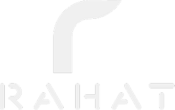

<body style="background-color:#171515;">

</body>
.

  

 
 

# 💫 About Me:
- 👋 Hi, I’m Rahat Sayyed
- 👀 I’m interested in ...???
- 🌱 I’m currently learning Blockchain Technology
- 💞️ I’m looking to collaborate on web dev or blockchain project 
- 📫 How to reach me <a href="mailto:sayyedrahat721@gmail.com" rel="nofollow">mail me</a>

# 💻 Tech Stack:
 
 
 
 
 
 
 
 
 
 
 
 
 
 
 	
 

# 📊 GitHub Stats:

<!--  -->
 

